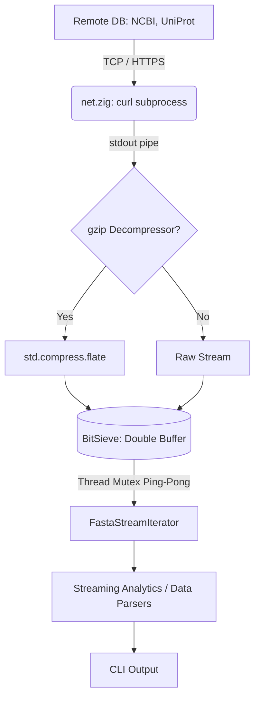

# BioZig Network Architecture (`net/`)

The `net/` module provides BioZig's ultra-high-performance, $O(1)$ memory ingestion engine. It is designed to stream massive datasets directly from remote databases into BioZig's analytical processing pipeline without buffering the payloads into RAM. It supports diverse biological data formats, from genomic sequences to small molecule payloads and atomic coordinates.

## 5 Major API Databases
BioZig's network layer natively integrates with 5 core external databases, providing automatic endpoint routing, fallback URLs, and payload formatting:
1. **NCBI Entrez** (`entrez.zig`): Primary source for reference genomes, FASTA/FASTQ sequence streams, and taxonomic data. (Fallback: ENA REST)
2. **UniProt** (`uniprot.zig`): Primary source for protein sequence data and functional annotations. (Fallback: EBI Proteins)
3. **RCSB PDB** (`pdb.zig`): Primary source for 3D atomic coordinates (e.g., streaming .pdb / .cif files for structural analysis). (Fallback: PDBe)
4. **ChEMBL** (`chembl.zig`): Primary source for bioactive molecule data, SMILES strings, and drug target JSON payloads. (Fallback: PubChem)
5. **Ensembl** (`ensembl.zig`): Primary source for vertebrate genome browsers, transcriptomics, and variation data. (Fallback: UCSC)

## The Core Concept: `BitSieve`

At the heart of the `net/` directory is the `BitSieve` engine (`bitsieve.zig`). The problem it solves is simple but severe: network I/O is volatile and slow, while CPU processing is fast. If we read synchronously, the CPU stalls waiting for packets. If we load the whole file asynchronously, we blow up RAM.

`BitSieve` solves this using a **Double-Buffered Ring Architecture** synchronized via Zig `std.Io.Mutex` and `std.Io.Condition`.

### Mechanism of Action
1. **Dual Buffers**: `BitSieve` maintains two fixed-size buffers in memory (`buffer_a` and `buffer_b`), typically 64KB each. Total memory footprint is strictly capped.
2. **Producer Thread (Network)**: The producer (the `curl` stream) fills `buffer_a`. Once full, it acquires a mutex, marks `buffer_a` as ready, signals the Consumer, and instantly pivots to filling `buffer_b` while `buffer_a` is processed.
3. **Consumer Thread (CPU)**: The analytical engine (Consumer) waits on the condition variable. As soon as `buffer_a` is marked ready, the Consumer locks it, runs $O(1)$ analytical math (like GC skew or Markov transitions), marks it as consumed, and signals the Producer. 
4. **The Ping-Pong**: The Producer and Consumer effectively "ping-pong" between the two buffers. The CPU never starves (because the next buffer is being filled while it processes the current one), and the Network never drops packets (because it always has a buffer to write to).

## Subprocess `curl` Engine and Protocol Switching (`net.zig` & `ftp.zig`)

We bypass the volatility and complexity of native socket handling across diverse NATs, TLS boundaries, and protocol states by utilizing a hybrid approach.

`net.zig` acts as the URL router. It takes abstract queries (e.g., `--db ncbi_ftp --query OM203953.1` or `--db chembl --query CHEMBL25`) and uses the respective API client struct (e.g., `ChemblClient.buildUrl`) to map them to physical endpoints. 

**Protocol Switching (HTTP vs FTP):**
- **HTTPS**: For standard REST APIs (NCBI, UniProt, ChEMBL, PDB), it spawns a `curl -sL` child process and grabs a handle to the `stdout` pipe, allowing standard HTTP streams with built-in redirection handling.
- **FTP**: For massive legacy databanks (e.g. `ncbi_ftp`), it utilizes the native FTP client (`ftp.zig`) which manages TCP command channels (`PASV` mode) and establishes secondary binary data sockets directly.

### Gzip On-the-Fly
If the stream is identified as compressed (e.g., ending in `.gz`), the pipeline seamlessly injects a `std.compress.flate.Decompress` layer between the raw stream and the `BitSieve` engine. This extracts the payload mathematically on the fly before it hits the analytical buffers.

## The Interfaces

- **Iterators**: `ingestion/genomics/fasta.zig` implements a `FastaStreamIterator` which wraps a pointer to the `BitSieve` reader interface. This allows algorithms to call `nextSequenceChunk()` to naturally pull slices without knowing they are coming over a TCP wire.
- **Streaming Analytics**: Analytical engines in `analytics/sequence/` implement "streaming" variants (e.g., `streamingShannonEntropy`) which are built as state machines. They accept chunks, update their internal mathematical state, and discard the chunk instantly.

## The Pipeline Flow

